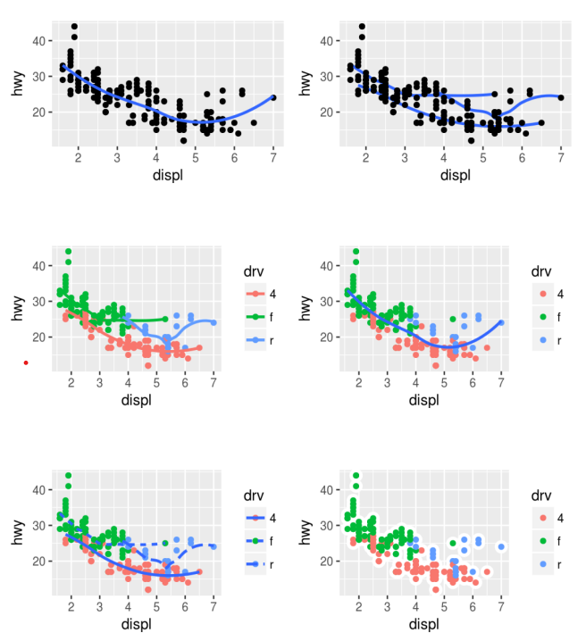

A `geom` is the geometrical object that a plot uses to represent data. People often describe plots by the type of geom that the plot uses. For example, bar charts use bar geom, line chart use line geom, boxplots use boxplot geom, and so on. Scatterplots break the trend; they use the point geom to plot the same data.

To change the geom in our plot, change the geom function that we add to `ggplot()`. For instance, to make the preceding plots, we can use this code.

```{r}
#left
ggplot(data = mpg) +
  geom_point(mapping = aes(x = displ, y = hwy))

#right
ggplot(data = mpg) +
  geom_smooth(mapping = aes(x = displ, y = hwy))
```

The plot on the left uses the point geom, and the plot on the right uses the smooth geom, a smooth line fitted to the data.

Every geom function in **ggplot2** takes a mapping argument. However not every aesthetic works with every geom. We could set the shape of a point but we could not set the "shape" of a line. On the other hand we could set the linetype of a `geom_smooth()` will draw a different line, with a different linetype, for each unique value of the variable that we map to linetype.

```{r}
ggplot(data = mpg) +
  geom_smooth(mapping = aes(x= displ, y = hwy, linetype = drv))
```

Here `geom_smooth()` separates the cars into three lines based on their `drv` value, which describes a car's drivetrain. One line describes all of the points with a 4 value, one line describes all of the points with an `f` value, and one line describes all of the points with an `r` value. Here `4` stands for four-wheel drive, `f` for front-wheel drive, and `r` for rear-wheel drive.

If this sounds strange, we can make it more clear by overlaying the lines on top of the raw data and then coloring everything according to `drv`.

```{r}
ggplot(data = mpg) +
  geom_point(mapping = aes(x = displ, y = hwy, color = drv)) +
  geom_smooth(mapping = aes(x= displ, y = hwy, color = drv,linetype = drv))
```

Notice that this plot contains two geoms in the same graph! If this makes your excited, buckle up, in the next section we will learn how to place multiple geoms in the same plot.

Many geoms, like `geom_smooth()`, use a single geometric object to display multiple rows of data. For these geoms, we can set the group aesthetic to a categorical variable to draw multiple objects. **ggplot2** will draw a separate object for each unique value of the grouping variable. **ggplot2** will automatically group the data for these geoms whenever we map an aesthetic to a discrete variable. It is convenient to rely on this feature because the group aesthetic by itself does not add a legend for distinguishing features to geoms.

```{r}
ggplot(data = mpg) +
  geom_smooth(mapping = aes(x = displ, y = hwy))

ggplot(data = mpg) +
  geom_smooth(mapping = aes(x = displ, y = hwy, group = drv))

ggplot(data = mpg) +
  geom_smooth(mapping = aes(x = displ, y = hwy, color = drv), show.legend = FALSE)
```

To display multiple geoms in the same plot, add multiple geom functions to `ggplot()`:

```{r}
ggplot(data = mpg) +
  geom_smooth(mapping = aes(x = displ, y = hwy)) + 
  geom_point(mapping = aes(x = displ, y = hwy))
  
```

This, however, introduces some duplication in our code. We can avoid this type of repetition by passing a set of mapping to `ggplot()`. **ggplot2** will treat these mappings as global mapping that apply to each geom in the graph.

```{r}
ggplot(data = mpg, mapping = aes(x = displ, y = hwy)) +
  geom_point() +
  geom_smooth()
```

If we place mappings in a geom function, **ggplot2** will treat them as local mappings for the layer.

```{r}
ggplot(data = mpg, mapping = aes(x = displ, y = hwy)) +
  geom_point(mapping = aes(color = class)) +
  geom_smooth()
```

We can also use the same idea to specify different data for each layer. Here, our smooth line displays just a subset of the `mpg` dataset, the subcompact cars. The local data argument in `geom_object()` overrides the global data argument in `ggplot()` for that layer only.

```{r}
ggplot(data = mpg, mapping = aes(x = displ, y = hwy)) +
  geom_point(mapping = aes(color = class)) +
  geom_smooth(data = filter(mpg, class == 'subcompact'), se = FALSE)
```

## Exercise

1.  What geom would you use to draw a line chart? A boxplot? A histogram? An area chart?

2.  Run this code in you head and predict what the output will look like. Then run the code in R and check your predictions:

    `ggplot(`

    `data = mpg,`

    `mapping = aes(x = displ, y = hwy, color = drv)`

    `) +`

    `geom_point() +`

    `geom_smooth(se = FALSE)`

3.  What does `show.legend = FALSE` do? What happens if you remove it?

4.  What does the `se` argument to `geom_smooth()` do?

5.  Will these two graphs look different? Why/Why not?

    `ggplot(data = mpg, mapping = aes(x = displ, y = hwy)) + geom_point() + geom_smooth()`

    `ggplot() + geom_point(data = mpg, mapping = aes(x = displ, y = hwy)) + geom_smooth(data = mpg, mapping = aes(x = displ, y = hwy))`

6.  Re-create the R code necessary to generate the following graphs.

    {width="441"}

## Answer

**1**

```{r}
#What geom would you use to draw a line chart? A boxplot? A histogram? An area chart?
ggplot(data = mpg) +
  geom_line(mapping = aes(x = displ, y = hwy))
```

I would choose `geom_line()` to draw the line chart, as shown above.

**2**

```{r}
# Run this code in you head and predict what the output will look like. Then run the code in R and check your predictions:

ggplot(data = mpg, mapping = aes(x = displ, y = hwy, color = drv)) +
  geom_point() +
  geom_smooth(se = FALSE)
```

**3**

```{r}
# What does show.legend = FALSE do? What happens if you remove it?
ggplot(data = mpg, mapping = aes(x = displ, y = hwy, color = drv)) +
  geom_point(show.legend = FALSE) +
  geom_smooth(se = FALSE, show.legend = FALSE)
```

`show.legend = FALSE` remove the legends from the plot. We can see the difference from above two plots. If we remove it, by default we can see the legends while plotting the chart.

**4**

```{r}
# What does the se argument to geom_smooth() do?
?geom_smooth()
```

It adds standard error band to the lines. By default `se = TRUE`

```{r}
ggplot(data = mpg, mapping = aes(x = displ, y = hwy, color = drv)) +
  geom_point() +
  geom_smooth(se = TRUE)

ggplot(data = mpg, mapping = aes(x = displ, y = hwy, color = drv)) +
  geom_point() +
  geom_smooth(se = FALSE)
```

**5**

```{r}
#Will these two graphs look different? Why/Why not?

ggplot(data = mpg, mapping = aes(x = displ, y = hwy)) + 
  geom_point() + 
  geom_smooth()

ggplot() + 
  geom_point(data = mpg, mapping = aes(x = displ, y = hwy)) + 
  geom_smooth(data = mpg, mapping = aes(x = displ, y = hwy))
```

No, Because both `goem_point()` and `geom_smooth()` will use the same data and mappings. They will inherit those options from the `ggplot()` objects, so the mappings do not need to specified again.

**6**

```{r}
#Re-create the R code necessary to generate the following graphs. 
ggplot(data = mpg, mapping = aes(x = displ, y = hwy)) +
  geom_point() +
  geom_smooth(se = FALSE)

ggplot(data = mpg, mapping = aes(x = displ, y = hwy, group = drv)) +
  geom_point() +
  geom_smooth(se = FALSE)

ggplot(data = mpg, mapping = aes(x = displ, y = hwy, group = drv, color = drv)) +
  geom_point() +
  geom_smooth(se = FALSE)

ggplot(data = mpg, mapping = aes(x = displ, y = hwy)) +
  geom_point(mapping = aes(color = drv)) +
  geom_smooth(se = FALSE)

ggplot(data = mpg, mapping = aes(x = displ, y = hwy)) +
  geom_point(mapping = aes(color = drv)) +
  geom_smooth(mapping = aes(linetype = drv), se = FALSE)

ggplot(data = mpg, mapping = aes(x = displ, y = hwy)) +
  geom_point(mapping = aes(color = drv))
```
