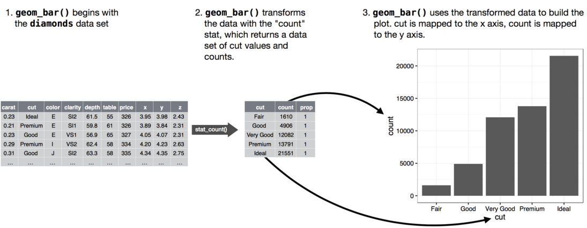

```{r}
options(warn=-1)
library(ggplot2)
```

Let's look at the bar chart. Bar Charts seem simple, but they are interesting because they reveal something subtle about plots. Consider a basic bar chart, as drawn with `geom_bar()`. The following chart displays the total number of diamonds in the `diamonds` dataset, grouped by `cut`. The `diamonds` dataset comes in **ggplot2** and contains information about \~54,000 diamonds, including `price, carat, clarity` and `cut` of each diamonds, The chart shows that more diamonds are available with high-quality cuts than with low quality cuts.

```{r}
ggplot(data = diamonds) + 
  geom_bar(mapping = aes(x = cut))
```

On the x-axis, the chart displays `cut`, a 'variable from `diamonds`. On the y-axis, it displays `count` is not a variable in `diamonds!` where does `count` come from? Many graphs, like scatterplots, plot the raw value of your dataset. Other graphs like bar charts, calculate new values to plot.

-   Bar charts, histograms, and frequency polygons bin your data and then plot bin counts, the number of points that fall in each bin

-   Smoothers fit a model to your data and then plot predictions from the model.

-   Boxplots compute a robust summary of the distribution and displays a specially formatted box.

The algorithm used to calculate new values for a graph is called a `stat`, short for statistical transformation. The following figure describes how this process work with `geom_bar()`.



`geom_bar` shows the default value for `stat` is "count", which means that `geom_bar()` uses `stat_count()`. `stat_count()` is documented on the same page as `geom_bar()`, and if you scroll down you can find a section called "Computer Variables". That tells that it computes two new variables `count` and `prop`.

We can generally use geoms and stats interchangeably. For example, we can re-create the previous plot using `stat_count()` instead of `geom_bar()`

```{r}
ggplot(data = diamonds) + 
  stat_count(mapping = aes(x = cut))
```

This works because every stats has a default geom. This means that we can typically use geoms without worrying about the underlying statistical transformation.

-   We want to override the default stat. In the following code, I change the stat of `geom_bar()` from count to identify. This lets me map the height of the bars to raw values of `y` variable. Unfortunately when people talk about bar charts casually, they might be referring to this type of bar chart, where the height of the bar is already present in the data, or the previous bar chart where height of the bar is generated by counting rows.

    ```{r}
    library(dplyr)
    ```

    ```{r}
    demo <- tribble(
      ~a,     ~b,
      "bar_1", 20,
      "bar_2", 30,
      "bar_3", 40
    )

    ggplot(data = demo) +
      geom_bar(
        mapping = aes(x = a, y = b), stat = "identity"
      )
    ```

    Don't worry if you have not seen `<-` or `tribble()` before. We will learn this in upcoming context.

-   We might want to override the default mapping from transformed variables to aesthetic. For example, we might want to display a bar chart of proportion, rather than count.

    ```{r}
    ggplot(data = diamonds) + 
      geom_bar(
        mapping = aes(x = cut, y = ..prop.., group = 1)
      )
    ```

    To find the variable computed by the stat, look for the help section titled "Computed Variables".

-   We might want to draw greater attention to the statistical transformation in our code. For example. We might use `stat_summary()`, which summarizes the y values for each unique `x` value, to draw attention to the summary that we are computing.

    ```{r}
    ggplot(data = diamonds) + 
      stat_summary(
        mapping = aes(x = cut, y = depth),
        fun.min = min,
        fun.max = max,
        fun = median
      )
    ```

**ggplot2** provides over 20 stats for us to use. Each stat is a function so we can get help in usual way, e.g., `?stat_bin`. To see a complete list of stats, try the **ggplot2** cheatsheet.

> #### TODO: 
>
> Please Complete the following exercise on your own.

## Exercise

1.  What is the default geom associated with `stat_summary()`? How could you rewrite the previous plot to use that geom function instead of stat function?

2.  What does `geom_col` do? How is it different to `geom_bar()`?

3.  Most geoms and stats come in pairs that are almost always used in concert. Read through the documentation and make a list of all pairs. What do they have in common?

4.  What variables does `stat_smooth()` compute? What parameters control its behavior?

5.  In our proportion bar chart, we need to set `group = 1`. Why? In other words what is the problem with these two graphs?

    `ggplot(data = diamonds) +`

    `geom_bar(mapping = aes(x = cut, y = ..prop..))`

    `ggplot(data = diamonds) +`

    `geom_bar(`

    `mapping = aes(x = cut, fill = color, y = ..prop..)`

    `)`

## Answer

**1**

> What is the default geom associated with stat_summary()? How could you rewrite the previous plot to use that geom function instead of stat function?

```{r}
?stat_summary()
#ggplot(data = diamonds) + 
#  stat_summary(
#    mapping = aes(x = cut, y = depth),
#    fun.min = min,
#    fun.max = max,
#    fun = median
#  )
```

The default geom for `stat_summary()` is `geom_pointrange()`. The default stat for `geom_pointrange()` is `identity()` but we can add the argument `stat = "summary"` to use `stat_summary()` instead of `stat_identity()`.

```{r}
ggplot(data = diamonds) + 
  geom_pointrange(mapping = aes(x = cut, y = depth), stat = "summary")
```

The resulting message says that `stat_summary()` uses the `mean` and `sd` to calculate the middle point and endpoints of the line. However, in the original plot the min and max values were used for the endpoints. To recreate the original plot we need to specify values for `fun.min`, `fun.max` and `fun`.

```{r}
ggplot(data = diamonds) + 
  geom_pointrange(mapping = aes(x = cut, y = depth), 
                  stat = "summary",
                  fun.min = min,
                  fun.max = max,
                  fun = median)
```

**2**

> What does geom_col do? How is it different to geom_bar()?

The `geom_col()` function has different stat than `geom_bar()`. The default stat of `geom_col()` is `stat_identity()`, which leaves the data as is. The `geom_col()` function expects that the data contains `x` values and `y` values which represent the bar height.

The default stat of `geom_bar()` is `stat_count()`. The `geom_bar()` function only expects an `x` variable. The stat, `stat_count()`, reprocesses input data by counting the number of observations for each value of `x`. The `y` aesthetic uses the values of these counts.

**3**

> Most geoms and stats come in pairs that are almost always used in concert. Read through the documentation and make a list of all pairs. What do they have in common?

The following tables lists the pairs of geoms and stats that are almost always used in concert.

| Complementary geoms and stats \|

|                         |                         |
|-------------------------|-------------------------|
| **geom**                | **stat**                |
| `geom_bar()`            | `stat_count()`          |
| `geom_bin2d()`          | `stat_bin_2d()`         |
| `geom_boxplot()`        | `stat_boxplot()`        |
| `geom_contour_filled()` | `stat_contour_filled()` |
| `geom_contour()`        | `stat_contour()`        |
| `geom_count()`          | `stat_sum()`            |
| `geom_density_2d()`     | `stat_density_2d()`     |
| `geom_density()`        | `stat_density()`        |
| `geom_dotplot()`        | `stat_bindot()`         |
| `geom_function()`       | `stat_function()`       |
| `geom_sf()`             | `stat_sf()`             |
| `geom_sf()`             | `stat_sf()`             |
| `geom_smooth()`         | `stat_smooth()`         |
| `geom_violin()`         | `stat_ydensity()`       |
| `geom_hex()`            | `stat_bin_hex()`        |
| `geom_qq_line()`        | `stat_qq_line()`        |
| `geom_qq()`             | `stat_qq()`             |
| `geom_quantile()`       | `stat_quantile()`       |

These pairs of geoms and stats tend to have their names in common, such `stat_smooth()` and `geom_smooth()` and be documented on the same help page. The pairs of geoms and stats that are used in concert often have each other as the default stat (for a geom) or geom (for a stat).

The following tables contain the geoms and stats in [ggplot2](https://ggplot2.tidyverse.org/reference/) and their defaults as of version 3.3.0. Many geoms have `stat_identity()` as the default stat.

| ggplot2 geom layers and their default stats. |                            |                 |
|----------------------------------|---------------------|-----------------|
| **geom**                                     | **default stat**           | **shared docs** |
| `geom_abline()`                              | `stat_identity()`          |                 |
| `geom_area()`                                | `stat_identity()`          |                 |
| `geom_bar()`                                 | `stat_count()`             | x               |
| `geom_bin2d()`                               | `stat_bin_2d()`            | x               |
| `geom_blank()`                               | None                       |                 |
| `geom_boxplot()`                             | `stat_boxplot()`           | x               |
| `geom_col()`                                 | `stat_identity()`          |                 |
| `geom_count()`                               | `stat_sum()`               | x               |
| `geom_countour_filled()`                     | `stat_countour_filled()`   | x               |
| `geom_countour()`                            | `stat_countour()`          | x               |
| `geom_crossbar()`                            | `stat_identity()`          |                 |
| `geom_curve()`                               | `stat_identity()`          |                 |
| `geom_density_2d_filled()`                   | `stat_density_2d_filled()` | x               |
| `geom_density_2d()`                          | `stat_density_2d()`        | x               |
| `geom_density()`                             | `stat_density()`           | x               |
| `geom_dotplot()`                             | `stat_bindot()`            | x               |
| `geom_errorbar()`                            | `stat_identity()`          |                 |
| `geom_errorbarh()`                           | `stat_identity()`          |                 |
| `geom_freqpoly()`                            | `stat_bin()`               | x               |
| `geom_function()`                            | `stat_function()`          | x               |
| `geom_hex()`                                 | `stat_bin_hex()`           | x               |
| `geom_histogram()`                           | `stat_bin()`               | x               |
| `geom_hline()`                               | `stat_identity()`          |                 |
| `geom_jitter()`                              | `stat_identity()`          |                 |
| `geom_label()`                               | `stat_identity()`          |                 |
| `geom_line()`                                | `stat_identity()`          |                 |
| `geom_linerange()`                           | `stat_identity()`          |                 |
| `geom_map()`                                 | `stat_identity()`          |                 |
| `geom_path()`                                | `stat_identity()`          |                 |
| `geom_point()`                               | `stat_identity()`          |                 |
| `geom_pointrange()`                          | `stat_identity()`          |                 |
| `geom_polygon()`                             | `stat_identity()`          |                 |
| `geom_qq_line()`                             | `stat_qq_line()`           | x               |
| `geom_qq()`                                  | `stat_qq()`                | x               |
| `geom_quantile()`                            | `stat_quantile()`          | x               |
| `geom_raster()`                              | `stat_identity()`          |                 |
| `geom_rect()`                                | `stat_identity()`          |                 |
| `geom_ribbon()`                              | `stat_identity()`          |                 |
| `geom_rug()`                                 | `stat_identity()`          |                 |
| `geom_segment()`                             | `stat_identity()`          |                 |
| `geom_sf_label()`                            | `stat_sf_coordinates()`    | x               |
| `geom_sf_text()`                             | `stat_sf_coordinates()`    | x               |
| `geom_sf()`                                  | `stat_sf()`                | x               |
| `geom_smooth()`                              | `stat_smooth()`            | x               |
| `geom_spoke()`                               | `stat_identity()`          |                 |
| `geom_step()`                                | `stat_identity()`          |                 |
| `geom_text()`                                | `stat_identity()`          |                 |
| `geom_tile()`                                | `stat_identity()`          |                 |
| `geom_violin()`                              | `stat_ydensity()`          | x               |
| `geom_vline()`                               | `stat_identity()`          |                 |

| ggplot2 stat layers and their default geoms. |                         |                 |
|------------------------------------|--------------------|-----------------|
| **stat**                                     | **default geom**        | **shared docs** |
| `stat_bin_2d()`                              | `geom_tile()`           |                 |
| `stat_bin_hex()`                             | `geom_hex()`            | x               |
| `stat_bin()`                                 | `geom_bar()`            | x               |
| `stat_boxplot()`                             | `geom_boxplot()`        | x               |
| `stat_count()`                               | `geom_bar()`            | x               |
| `stat_countour_filled()`                     | `geom_contour_filled()` | x               |
| `stat_countour()`                            | `geom_contour()`        | x               |
| `stat_density_2d_filled()`                   | `geom_density_2d()`     | x               |
| `stat_density_2d()`                          | `geom_density_2d()`     | x               |
| `stat_density()`                             | `geom_area()`           |                 |
| `stat_ecdf()`                                | `geom_step()`           |                 |
| `stat_ellipse()`                             | `geom_path()`           |                 |
| `stat_function()`                            | `geom_function()`       | x               |
| `stat_function()`                            | `geom_path()`           |                 |
| `stat_identity()`                            | `geom_point()`          |                 |
| `stat_qq_line()`                             | `geom_path()`           |                 |
| `stat_qq()`                                  | `geom_point()`          |                 |
| `stat_quantile()`                            | `geom_quantile()`       | x               |
| `stat_sf_coordinates()`                      | `geom_point()`          |                 |
| `stat_sf()`                                  | `geom_rect()`           |                 |
| `stat_smooth()`                              | `geom_smooth()`         | x               |
| `stat_sum()`                                 | `geom_point()`          |                 |
| `stat_summary_2d()`                          | `geom_tile()`           |                 |
| `stat_summary_bin()`                         | `geom_pointrange()`     |                 |
| `stat_summary_hex()`                         | `geom_hex()`            |                 |
| `stat_summary()`                             | `geom_pointrange()`     |                 |
| `stat_unique()`                              | `geom_point()`          |                 |
| `stat_ydensity()`                            | `geom_violin()`         | x               |

**4**

> What variables does stat_smooth() compute? What parameters control its behavior?

The function `stat_smooth()` calculates the following variables:

-   `y`: predicted value

-   `ymin`: lower value of the confidence interval

-   `ymax`: upper value of the confidence interval

-   `se`: standard error

The \"Computed Variables\" section of the `stat_smooth()` documentation contains these variables.

The parameters that control the behavior of `stat_smooth()` include:

-   `method`: This is the method used to compute the smoothing line. If `NULL`, a default method is used based on the sample size: `stats::loess()` when there are less than 1,000 observations in a group, and `mgcv::gam()` with `formula = y ~ s(x, bs = "CS)` otherwise. Alternatively, the user can provide a character vector with a function name, e.g. `"lm"`, `"loess"`, or a function, e.g. `MASS::rlm`.

-   `formula`: When providing a custom `method` argument, the formula to use. The default is `y ~ x`. For example, to use the line implied by `lm(y ~ x + I(x ^ 2) + I(x ^ 3))`, use `method = "lm"` or `method = lm` and `formula = y ~ x + I(x ^ 2) + I(x ^ 3)`.

-   `method.arg()`: Arguments other than than the formula, which is already specified in the `formula` argument`, to pass to the function in`method\`.

-   `se`: If `TRUE`, display standard error bands, if `FALSE` only display the line.

-   `na.rm`: If `FALSE`, missing values are removed with a warning, if `TRUE` the are silently removed. The default is `FALSE` in order to make debugging easier. If missing values are known to be in the data, then can be ignored, but if missing values are not anticipated this warning can help catch errors.

**5**

> In our proportion bar chart, we need to set group = 1. Why? In other words what is the problem with these two graphs?

```{r}
ggplot(data = diamonds) +
  geom_bar(mapping = aes(x = cut, y = ..prop..))

ggplot(data = diamonds) +
  geom_bar(
    mapping = aes(x = cut, fill = color, y = ..prop..)
    )
```

If the `group = 1` is not included, then all the bars in the plot will have the same height, a height of 1. The function `geom_bar()` assumes that the groups are equal to the `x` values since the stat computes the counts within the group.

```{r}
ggplot(data = diamonds) +
  geom_bar(mapping = aes(x = cut, y = ..prop.. , group = 1))
```

With the `fill` aesthetic, the heights of the bars need to be normalized.

```{r}
ggplot(data = diamonds) +
  geom_bar(
    mapping = aes(x = cut, y = ..count../sum(..count..), fill = color))
```
