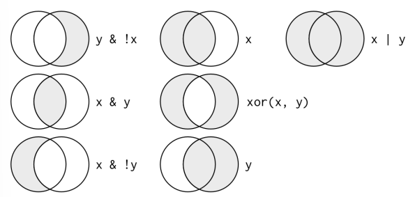

Visualization is an important tool for insight generation, but it is rare that we get the data in exactly the right form we need, Often we will need to create some new variables or summaries, or maybe we just to rename the variables or reorder the observations in order to make the data a little easier to work with. We will learn to all that in this curriculum.

In this part of context we will focus on how to use **dplyr** package another core member of the tidyverse. We'll illustrate the key ideas using data from the **nycflighs13** package, and use **ggplot2** to help us understand the data.

```{r}
library(nycflights13)
library(tidyverse)
```

Take careful note that the conflicts message that's printed when you load the tidyverse. If tell you that dplyr overwrites some functions in bass R. If you want to use the base version of these functions after loading **dplyr**, you'll need to use their full names: `stats::filter()` and `stats::lag()`

#### nycflighs13

Take a look at the data

```{r}
?flights
flights
```

We have noticed that the row of three - (or four-) letter abbreviations under the column names. These describes the type of each variable:

-   `int` stands for integers

-   `dbl` stands for doubles, or real numbers

-   `chr` stands for character vectors, or strings

-   `dttm` stands for date-times (a data + a time)

-   `lgl` stands for logical, vector that contain only `TRUE` or `FALSE.`

-   `fctr` stands for factors, which R uses to represent categorical variables with fixed possible values

-   `date` stands for dates.

# dplyr Basics

The five key **dplyr** functions that allows us to solve the vast majority of our data-manipulation challenges

-   Pick observations by their values (`filter()`)

-   Reorder the rows (`arrange()`)

-   Pick variables by their names (`select()`)

-   Create new variables with functions of existing variables (`mutate()`)

-   Collapse many values down to a single summary (`summarize()`)

These can all be used in conjunction with `group_by()`, which changes the scope of each function from operating on the entire dataset to operating on it group-by-group. These six functions provides the verbs for a language of data manipulation.

All verbs work similarly:

1.  The first argument is a data frame
2.  The subsequent arguments describe what to do with the data frame, using the variable names.
3.  The result is a new data frame.

### Filter Rows with filter()

`filter()` allows us to subset observations based on their values.

```{r}
filter(flights, month == 1, day == 1)
```

When we run that line of code, **dplyr** executes the filtering operation and return a new data frame. **dplyr** functions never modify their inputs, of if we want o save the result, we will need to use the assignment operator `<-.`

```{r}
jan1 <- filter(flights, month == 1, day == 1)
jan1
```

### Comparisons

To use the filtering effectively, we have to know how to select the observations that we want using the comparison operators. R provides the standard suite: `>, >=, <=, <, !=`(not equal), and `==` (equal).

The easiest mistake to make is to use `=` instead of `==` when testing for equality. When this happens we will get an informative error

```{r}
# filter(flights, month = 1)
```

Uncomment the above code to see the error

There's another common problem we might encounter when using `==`; floating-point numbers. These results might surprise us!

```{r}
sqrt(2) ^ 2 == 2
```

```{r}
1 / 49 * 49 == 1
```

Computers use finite precision arithmetic (they obviously can't store an infinite number of digits!) so remember that every number we see is an approximation. Instead of relying on `==`, use `near()`

```{r}
near(sqrt(2) ^ 2, 2)
```

```{r}
near(1 / 49 * 49, 1) 
```

### Logical Operators

Multiple arguments to `filter()` are combined with "and": every expression must be true in order for a row to be included in the output. For other types of combinations, we will need to use Boolean operators our self: `&` is "and", `|` is "or", and `!` is "not".



The following code finds all flights that departed in November or December

```{r}
filter(flights, month == 11 | month == 12)
```

The order of operations does not work like English, We cannot write `filter(flights, month == 11 | 12)`, which we might literally translate into "finds all the flights that departed in November or December". Instead it finds all months that equal `11 | 12`, an expression that evaluates to `TRUE`. In a numeric context (like here), `TRUE` becomes one, so this finds all flights in January, not November or December. This is quite confusing.

A useful shorthand for this problem is `x %in% y`. This will select every row where `x` is one of the values in `y`. We could use it to rewrite the preceding code.

```{r}
nov_dec <- filter(flights, month %in% c(11,12))
nov_dec
```

Sometimes we can simplify complicated subsetting by remembering De Morgan's law: `!(x & y)` is the same as `!x | !y`, and `!(x | y)` is the same as `!x & !y`. For example, if we wanted to find flights that were not delayed by more than two hours, we could use either of the following filters.

```{r}
filter(flights, !(arr_delay > 120 | dep_delay > 120))
```

```{r}
filter(flights, arr_delay <= 120, dep_delay <= 120)
```

Whenever we start using complicated, multipart expression in `filter()`, consider making them explicit variables instead. That makes it much easier to check our work.

### Missing Values

One important feature of R that can make comparison tricky is missing values or `NAs` ("not available"). `NA` represents an unknown value so missing values are "contagious"; almost any operation involving an unknown value will also unknown.

```{r}
NA > 5
```

```{r}
10 == NA
```

```{r}
NA + 10
```

```{r}
NA / 2
```

The most common confusing result is this one

```{r}
NA == NA
```

It's easiest to understand why this is true with a bit more context

```{r}
# Let x be Mary's age. We don't know how old she is
x <- NA

#Let y be John's age. We don't know how old he is.
y <- NA

# are John and Marry the same age?
x == y
```

If we want to determine if a value is missing, use `is.na()`:

```{r}
is.na(x)
```

`filter()` only includes rows where the condition is `TRUE`l it excludes both `FALSE` and `NA` values. If we want to preserve missing values, ask for them explicitly.

```{r}
df <- tibble(x = c(1, NA, 3))
filter(df, x > 1)
```

```{r}
filter(df, is.na(x) | x > 1)
```

## Exercise

1.  Find all flights that:

    a\. Had an arrival delay of two or more hours

    b\. Flew to Houston (`IAH` or `HOU`)

    c\. Were operated by United, American or Delta

    d\. Departed in summer (July, August and September)

    e\. Arrived more than two hours late, but did not leave late

    f\. Were delayed by at least an hour, but made up over 30 minutes in flight

    g\. Departed between midnight and 6 a.m. (inclusive)

2.  Another useful **dplyr** filtering helper `between()`. What does it do? Can you use it to simplify the code needed to answer the previous challenges?

3.  How many flights have a missing `dep_time`? What other variables are missing? What might these rows represent?

4.  Why is `NA ^ 0` not missing? Why is `NA | TRUE` not missing? Why is `FALSE & NA` not missing? Can you figure out the general rule? (`NA * 0` is a tricky (counterexample!)

### TODO:

**Please complete the exercise on your own.**

## Answer

**1**

> Find all flights that:

**a.**

> Had an arrival delay of two or more hours

```{r}
filter(flights, arr_delay >= 120)
```

**b.**

> Flew to Houston (`IAH` or `HOU`)

```{r}
filter(flights, dest == 'IAH' | dest == 'HOU')
```

**c.**

> Were operated by United, American or Delta

```{r}
airlines
```

```{r}
filter(flights, carrier %in% c("UA", "AA", "DL"))
```

**d.**

> Departed in summer (July, August and September)

```{r}
filter(flights, month >= 7, month <= 9)
```

**e.**

> Arrived more than two hours late, but did not leave late

```{r}
filter(flights, arr_delay > 120 & dep_delay <= 0)
```

**f.**

> Were delayed by at least an hour, but made up over 30 minutes in flight

```{r}
filter(flights, dep_delay >= 60 & dep_delay - arr_delay > 30)
```

**g.**

> Departed between midnight and 6 a.m. (inclusive)

```{r}
filter(flights, dep_time <= 600 | dep_time == 2400)
```

**2.**

> Another useful **dplyr** filtering helper `between()`. What does it do? Can you use it to simplify the code needed to answer the previous challenges?

The expression `between(x, left, right)` is equivalent to `x >= left & x <= right`.

Of the answers in the previous question, we could simplify the statement of *departed in summer* (`month >= 7 & month <= 9`) using the `between()` function.

```{r}
filter(flights, between(month, 7, 9))
```

**3.**

> How many flights have a missing `dep_time`? What other variables are missing? What might these rows represent?

```{r}
filter(flights, is.na(dep_time))
```

Notably, the arrival time (`arr_time`) is also missing for these rows. These seem to be cancelled flights.

The output of the function `summary()` includes the number of missing values for all non-character variables.

```{r}
summary(flights)
```

**4**

> Why is `NA ^ 0` not missing? Why is `NA | TRUE` not missing? Why is `FALSE & NA` not missing? Can you figure out the general rule? (`NA * 0` is a tricky counterexample!)

```{r}
NA ^ 0
```

`NA ^ 0 == 1` since for all numeric values `x^0 = 1`

```{r}
NA | TRUE
```

`NA | TRUE` is `TRUE` because anything or `TRUE` is `TRUE`. If the missing value were `TRUE`, then `TRUE | TRUE == TRUE`, and if the missing value was `FALSE`, then `FALSE | TRUE == TRUE`.

```{r}
NA & FALSE
```

The value of `NA & FALSE` is `FALSE` because anything **and** `FALSE` is always `FALSE`. If the missing value were `TRUE`, then `TRUE & FALSE == FALSE`, and if the missing value was `FALSE`, then `FALSE & FALSE == FALSE`

```{r}
NA | FALSE
```

For `NA | FALSE`, the value is unknown since `TRUE | FALSE == TRUE`, but `FALSE | FALSE == FALSE`.

```{r}
NA & TRUE
```

For `NA & TRUE`, the value is unknown since `FALSE & TRUE== FALSE`, but `TRUE & TRUE == TRUE`.

```{r}
NA * 0
```

Since `x * 0 = 0` for all finite numbers we might expect `NA * 0 == 0`, but that\'s not the case. The reason that `NA * 0 != 0` is that `0 * Inf` and `0 * -Inf` are undefined. R represents undefined results as `NaN`, which is an abbreviation of \"[not a number](https://en.wikipedia.org/wiki/NaN)\".

```{r}
Inf * 0
```

```{r}
-Inf * 0
```
